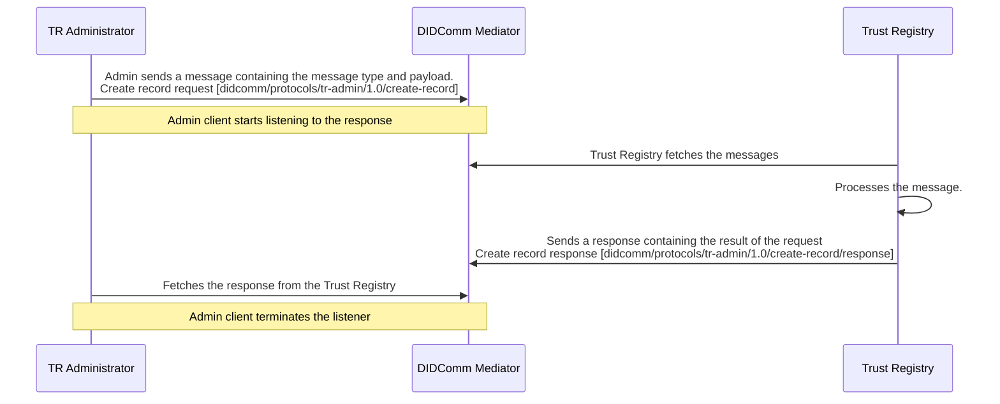
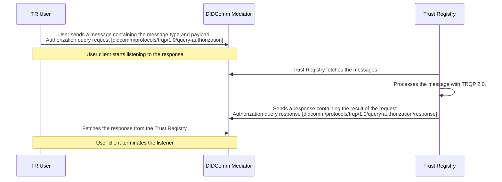

# Trust Registry DIDComm Protocols

Trust Registry utilises DIDComm protocols to manage and query trust records securely and privately.

DIDComm offers a flexible messaging service that enables you to define higher-level protocols, allowing for workflow orchestration tailored to specific purposes.

<!-- omit from toc -->
## Table of Contents

- [Trust Registry Administration](#trust-registry-administration)
  - [Summary](#summary)
  - [Motivation](#motivation)
  - [Roles](#roles)
  - [Requirements](#requirements)
  - [Workflow](#workflow)
  - [Messages](#messages)
- [Trust Registry Queries](#trust-registry-queries)
  - [Summary](#summary-1)
  - [Motivation](#motivation-1)
  - [Roles](#roles-1)
  - [Requirements](#requirements-1)
  - [Workflow](#workflow-1)
  - [Messages](#messages-1)
- [Problem Reporting](#problem-reporting)
- [Security Considerations](#security-considerations)
- [Implementation](#implementation)


## Trust Registry Administration

### Summary

A protocol to manage trust records in the Trust Registry.

### Motivation

To provide a secure and private communication between Administrator and Trust Registry to manage the trust records.

### Roles

There are two roles defined in managing trust records:

- **Admin:** The DID that sends a request to create, update, delete, or list trust records.
- **Trust Registry:** The DID that processes the request to manage the trust records.

### Requirements

- DIDComm v2.1 protocol.
- Admin DID **MUST** be authorised by the Trust Registry to receive messages.

### Workflow

When managing the trust records, the admin initiates the request by sending a message to the Trust Registry's DID through the DIDComm mediator.

*Sample create record flow.*



### Messages


#### create-record

Request to create a trust record into the Trust Registry.

**Message Type URI:**

Action | Message Type |
-------|--------------|
Request | `https://affinidi.com/didcomm/protocols/tr-admin/1.0/create-record` |
Response | `https://affinidi.com/didcomm/protocols/tr-admin/1.0/create-record/response` |

**Message Fields:**

- **`authority_id` REQUIRED** - The DID of the authority who authorised the entity and publishes the governance framework.
- **`entity_id` REQUIRED** - The DID of the entity authorised and recognised by the authority.
- **`authorized` REQUIRED** - Whether the defined authority authorises the entity.
- **`recognized` REQUIRED** - Whether the defined authority recognises the entity.
- **`action` REQUIRED** - A published vocabulary of common actions that the entity is authorised or recognised to perform.
- **`resource` REQUIRED** - The resource identifier where the entity can perform the stated action.
- **`context` OPTIONAL** - A JSON object that contains optional parameters that provides the governance framework or trust domain under which the authorisation is valid. 
    
    For example, *"Is Clinic X authorised by Health Department Y to issue credentials under Healthcare Governance Framework?"* and the requester can use the context to ensure that the authorisation is valid within a specific governance framework.


**Example:**

Request:

```json
{
    "id": "040d3b97-0be8-43f8-8a95-b3a926aadff1",
    "typ": "application/didcomm-plain+json",
    "type_": "https://affinidi.com/didcomm/protocols/tr-admin/1.0/create-record",
    "body": {
      "action": "action_xyz",
      "authority_id": "did:example:authority456",
      "authorized": true,
      "context": {
        "id": "https://governance.example.org/healthcare-framework",
        "type": "GovernanceFramework",
        "name": "Healthcare Trust Framework",
        "version": "1.0"
      },
      "entity_id": "did:example:entity123",
      "recognized": true,
      "resource": "resource_abc"
    },
    "from": "<ADMINISTRATOR_DID>",
    "to": [
        "<TRUST_REGISTRY_DID>",
    ],
    "thid": "6a627735-6743-4141-8cb7-1359d778936b"
}
```

Response:

```json
{
    "id": "040d3b97-0be8-43f8-8a95-b3a926aadff2",
    "typ": "application/didcomm-plain+json",
    "type_": "https://affinidi.com/didcomm/protocols/tr-admin/1.0/create-record/response",
    "body": {
      "action": "action_xyz",
      "authority_id": "did:example:authority456",
      "entity_id": "did:example:entity123",
      "resource": "resource_abc"
    },
    "from": "<TRUST_REGISTRY_DID>",
    "to": [
        "<ADMINISTRATOR_DID>",
    ],
    "thid": "6a627735-6743-4141-8cb7-1359d778936b"
}
```


#### update-record

Request to update existing trust record in the Trust Registry.

**Message Type URI:**

Action | Message Type |
-------|--------------|
Request | `https://affinidi.com/didcomm/protocols/tr-admin/1.0/update-record` |
Response | `https://affinidi.com/didcomm/protocols/tr-admin/1.0/update-record/response` |

**Message Fields:**

- **`authority_id` REQUIRED** - The DID of the authority who authorised the entity and publishes the governance framework.
- **`entity_id` REQUIRED** - The DID of the entity authorised and recognised by the authority.
- **`authorized` REQUIRED** - Whether the defined authority authorises the entity.
- **`recognized` REQUIRED** - Whether the defined authority recognises the entity.
- **`action` REQUIRED** - A published vocabulary of common actions that the entity is authorised or recognised to perform.
- **`resource` REQUIRED** - The resource identifier where the entity can perform the stated action.
- **`context` OPTIONAL** - A JSON object that contains optional parameters that provides the governance framework or trust domain under which the authorisation is valid. 
    
    For example, *"Is Clinic X authorised by Health Department Y to issue credentials under Healthcare Governance Framework?"* and the requester can use the context to ensure that the authorisation is valid within a specific governance framework.

**Example:**

Request:

```json
{
    "id": "040d3b97-0be8-43f8-8a95-b3a926aadff1",
    "typ": "application/didcomm-plain+json",
    "type_": "https://affinidi.com/didcomm/protocols/tr-admin/1.0/update-record",
    "body": {
      "action": "action_xyz",
      "authority_id": "did:example:authority456",
      "authorized": false,
      "context": {
        "id": "https://governance.example.org/healthcare-framework",
        "type": "GovernanceFramework",
        "name": "Healthcare Trust Framework",
        "version": "2.0"
      },
      "entity_id": "did:example:entity123",
      "recognized": false,
      "resource": "resource_abc"
    },
    "from": "<ADMINISTRATOR_DID>",
    "to": [
        "<TRUST_REGISTRY_DID>",
    ],
    "thid": "6a627735-6743-4141-8cb7-1359d778936b"
}
```

Response:

```json
{
    "id": "040d3b97-0be8-43f8-8a95-b3a926aadff2",
    "typ": "application/didcomm-plain+json",
    "type_": "https://affinidi.com/didcomm/protocols/tr-admin/1.0/update-record/response",
    "body": {
      "action": "action_xyz",
      "authority_id": "did:example:authority456",
      "entity_id": "did:example:entity123",
      "resource": "resource_abc"
    },
    "from": "<TRUST_REGISTRY_DID>",
    "to": [
        "<ADMINISTRATOR_DID>",
    ],
    "thid": "6a627735-6743-4141-8cb7-1359d778936b"
}
```

#### delete-record

Request to delete a trust record from the Trust Registry.

**Message Type URI:**

Action | Message Type |
-------|--------------|
Request | `https://affinidi.com/didcomm/protocols/tr-admin/1.0/delete-record` |
Response | `https://affinidi.com/didcomm/protocols/tr-admin/1.0/delete-record/response` |

**Message Fields:**

- **`authority_id` REQUIRED** - The DID of the authority who authorised the entity and publishes the governance framework.
- **`entity_id` REQUIRED** - The DID of the entity authorised and recognised by the authority.
- **`action` REQUIRED** - A published vocabulary of common actions that the entity is authorised or recognised to perform.
- **`resource` REQUIRED** - The resource identifier where the entity can perform the stated action.

**Example:**

Request:

```json
{
    "id": "040d3b97-0be8-43f8-8a95-b3a926aadff1",
    "typ": "application/didcomm-plain+json",
    "type_": "https://affinidi.com/didcomm/protocols/tr-admin/1.0/delete-record",
    "body": {
      "action": "action_xyz",
      "authority_id": "did:example:authority456",
      "entity_id": "did:example:entity123",
      "resource": "resource_abc"
    },
    "from": "<ADMINISTRATOR_DID>",
    "to": [
        "<TRUST_REGISTRY_DID>",
    ],
    "thid": "6a627735-6743-4141-8cb7-1359d778936b"
}
```

Response:

```json
{
    "id": "040d3b97-0be8-43f8-8a95-b3a926aadff2",
    "typ": "application/didcomm-plain+json",
    "type_": "https://affinidi.com/didcomm/protocols/tr-admin/1.0/delete-record/response",
    "body": {
      "action": "action_xyz",
      "authority_id": "did:example:authority456",
      "entity_id": "did:example:entity123",
      "resource": "resource_abc"
    },
    "from": "<TRUST_REGISTRY_DID>",
    "to": [
        "<ADMINISTRATOR_DID>",
    ],
    "thid": "6a627735-6743-4141-8cb7-1359d778936b"
}
```
   
#### read-record

Retrieves a trust record from the Trust Registry.

**Message Type URI:**

Action | Message Type |
-------|--------------|
Request | `https://affinidi.com/didcomm/protocols/tr-admin/1.0/read-record` |
Response | `https://affinidi.com/didcomm/protocols/tr-admin/1.0/read-record/response` |

**Message Fields:**

- **`authority_id` REQUIRED** - The DID of the authority who authorised the entity and publishes the governance framework.
- **`entity_id` REQUIRED** - The DID of the entity authorised and recognised by the authority.
- **`action` REQUIRED** - A published vocabulary of common actions that the entity is authorised or recognised to perform.
- **`resource` REQUIRED** - The resource identifier where the entity can perform the stated action.

**Example:**

Request:

```json
{
    "id": "040d3b97-0be8-43f8-8a95-b3a926aadff1",
    "typ": "application/didcomm-plain+json",
    "type_": "https://affinidi.com/didcomm/protocols/tr-admin/1.0/read-record",
    "body": {
      "action": "action_xyz",
      "authority_id": "did:example:authority456",
      "entity_id": "did:example:entity123",
      "resource": "resource_abc"
    },
    "from": "<ADMINISTRATOR_DID>",
    "to": [
        "<TRUST_REGISTRY_DID>",
    ],
    "thid": "6a627735-6743-4141-8cb7-1359d778936b"
}
```

Response:

```json
{
    "id": "040d3b97-0be8-43f8-8a95-b3a926aadff2",
    "typ": "application/didcomm-plain+json",
    "type_": "https://affinidi.com/didcomm/protocols/tr-admin/1.0/read-record/response",
    "body": {
      "action": "action_xyz",
      "authority_id": "did:example:authority456",
      "authorized": false,
      "context": {
        "id": "https://governance.example.org/healthcare-framework",
        "type": "GovernanceFramework",
        "name": "Healthcare Trust Framework",
        "version": "2.0"
      },
      "entity_id": "did:example:entity123",
      "recognized": false,
      "resource": "resource_abc"
    },
    "from": "<TRUST_REGISTRY_DID>",
    "to": [
        "<ADMINISTRATOR_DID>",
    ],
    "thid": "6a627735-6743-4141-8cb7-1359d778936b"
}
```

#### list-records

List all trust records from the Trust Registry.

**Message Type URI:**

Action | Message Type |
-------|--------------|
Request | `https://affinidi.com/didcomm/protocols/tr-admin/1.0/list-records` |
Response | `https://affinidi.com/didcomm/protocols/tr-admin/1.0/list-records/response` |

**Message Fields:**

No message body.

**Example:**

Request:

```json
{
    "id": "040d3b97-0be8-43f8-8a95-b3a926aadff1",
    "typ": "application/didcomm-plain+json",
    "type_": "https://affinidi.com/didcomm/protocols/tr-admin/1.0/list-records",
    "body": {},
    "from": "<ADMINISTRATOR_DID>",
    "to": [
        "<TRUST_REGISTRY_DID>",
    ],
    "thid": "6a627735-6743-4141-8cb7-1359d778936b"
}
```

Response:

```json
{
    "id": "040d3b97-0be8-43f8-8a95-b3a926aadff2",
    "typ": "application/didcomm-plain+json",
    "type_": "https://affinidi.com/didcomm/protocols/tr-admin/1.0/list-records/response",
    "body": {
        "count": 3,
        "records": [
            {
                "action": "action3",
                "authority_id": "did:example:authority3",
                "authorized": true,
                "context": {},
                "entity_id": "did:example:entity3",
                "recognized": true,
                "resource": "resource3"
            },
            {
                "action": "action1",
                "authority_id": "did:example:authority1",
                "authorized": true,
                "context": {
                    "additional": "context"
                },
                "entity_id": "did:example:entity1",
                "recognized": true,
                "resource": "resource1"
            },
            {
                "action": "action_xyz",
                "authority_id": "did:example:authority456",
                "authorized": false,
                "context": {
                  "id": "https://governance.example.org/healthcare-framework",
                  "type": "GovernanceFramework",
                  "name": "Healthcare Trust Framework",
                  "version": "2.0"
                },
                "entity_id": "did:example:entity123",
                "recognized": false,
                "resource": "resource_abc"
            }
        ]
    },
    "from": "<TRUST_REGISTRY_DID>",
    "to": [
        "<ADMINISTRATOR_DID>",
    ],
    "thid": "6a627735-6743-4141-8cb7-1359d778936b"
}
```

## Trust Registry Queries

### Summary

A protocol to query trust records from the Trust Registry using TRQP 2.0.

### Motivation

To provide a secure, end-to-end encrypted query messages between Verifiers and Trust Registry.

### Roles

There are two roles defined in querying trust records:

- **Verifier:** The DID that queries the Trust Registry to verify whether a particular DID is authorised or recognised by an authority based on governance framework.
- **Trust Registry:** The DID that processes the request to query trust records and return the result to the requester.

### Requirements

- DIDComm v2.1 protocol.

### Workflow

When querying trust records, the user initiates the request by sending a query message to the Trust Registry's DID through the DIDComm mediator.

*Sample query flow.*



### Messages

#### query-authorization

A query message to the Trust Registry if a given entity is authorized by a particular authority through its governance framework.

**Message Type URI:**

Action | Message Type |
-------|--------------|
Request | `https://affinidi.com/didcomm/protocols/trqp/1.0/query-authorization` |
Response | `https://affinidi.com/didcomm/protocols/trqp/1.0/query-authorization/response` |

**Message Fields:**

- **`authority_id` REQUIRED** - The DID of the authority who authorised the entity and publishes the governance framework.
- **`entity_id` REQUIRED** - The DID of the entity who is the subject of verification whether it is authorised by the authority.
- **`action` REQUIRED** - A published vocabulary of common actions that the entity is authorised to perform.
- **`resource` REQUIRED** - The resource identifier where the entity can perform the stated action.

**Additional Fields:**

- **`record_type`** - Part of the query response. The type of record requested by the verifier.
- **`time_requested`** - Part of the query response. The date and time the query is sent to the Trust Registry by the verifier.
- **`time_evaluated`** - Part of the query response. The date and time the query is evaluated.
- **`message`** - Part of the query response. A human-readable message about the result of the query.

**Example:**

Request:

```json
{
    "id": "040d3b97-0be8-43f8-8a95-b3a926aadff1",
    "typ": "application/didcomm-plain+json",
    "type_": "https://affinidi.com/didcomm/protocols/trqp/1.0/query-authorization",
    "body": {
      "action": "action_xyz",
      "authority_id": "did:example:authority456",
      "entity_id": "did:example:entity123",
      "resource": "resource_abc"
    },
    "from": "<VERIFIER_DID>",
    "to": [
        "<TRUST_REGISTRY_DID>",
    ],
    "thid": "6a627735-6743-4141-8cb7-1359d778936b"
}
```

Response:

```json
{
    "id": "040d3b97-0be8-43f8-8a95-b3a926aadff2",
    "typ": "application/didcomm-plain+json",
    "type_": "https://affinidi.com/didcomm/protocols/trqp/1.0/query-authorization/response",
    "body": {
      "action": "action_xyz",
      "authority_id": "did:example:authority456",
      "authorized": true,
      "context": {
        "id": "https://governance.example.org/healthcare-framework",
        "type": "GovernanceFramework",
        "name": "Healthcare Trust Framework",
        "version": "2.0"
      },
      "entity_id": "did:example:entity123",
      "resource": "resource_abc",
      "record_type":"Authorization",
      "time_requested":"2025-12-09T05:33:52Z",
      "time_evaluated":"2025-12-09T05:33:52Z",
      "message": "did:example:entity123 authorized to action1+resource1 by did:example:authority456 to issue a certificate credential."
    },
    "from": "<TRUST_REGISTRY_DID>",
    "to": [
        "<VERIFIER_DID>",
    ],
    "thid": "6a627735-6743-4141-8cb7-1359d778936b"
}
```

#### query-recognition

A query message to the Trust Registry if a given entity is recognised by a particular authority through its governance framework.

**Message Type URI:**

Action | Message Type |
-------|--------------|
Request | `https://affinidi.com/didcomm/protocols/trqp/1.0/query-recognition` |
Response | `https://affinidi.com/didcomm/protocols/trqp/1.0/query-recognition/response` |

**Message Fields:**

- **`authority_id` REQUIRED** - The DID of the authority who recognised the entity and publishes the governance framework.
- **`entity_id` REQUIRED** - The DID of the entity who is the subject of verification whether it is recognised by the authority.
- **`action` REQUIRED** - A published vocabulary of common actions that the entity is recognised to perform.
- **`resource` REQUIRED** - The resource identifier where the entity can perform the stated action.

**Additional Fields:**

- **`record_type`** - Part of the query response. The type of record requested by the verifier.
- **`time_requested`** - Part of the query response. The date and time the query is sent to the Trust Registry by the verifier.
- **`time_evaluated`** - Part of the query response. The date and time the query is evaluated.
- **`message`** - Part of the query response. A human-readable message about the result of the query.

**Example:**

Request:

```json
{
    "id": "040d3b97-0be8-43f8-8a95-b3a926aadff1",
    "typ": "application/didcomm-plain+json",
    "type_": "https://affinidi.com/didcomm/protocols/trqp/1.0/query-recognition",
    "body": {
      "action": "action_xyz",
      "authority_id": "did:example:authority456",
      "entity_id": "did:example:entity123",
      "resource": "resource_abc"
    },
    "from": "<VERIFIER_DID>",
    "to": [
        "<TRUST_REGISTRY_DID>",
    ],
    "thid": "6a627735-6743-4141-8cb7-1359d778936b"
}
```

Response:

```json
{
    "id": "040d3b97-0be8-43f8-8a95-b3a926aadff2",
    "typ": "application/didcomm-plain+json",
    "type_": "https://affinidi.com/didcomm/protocols/trqp/1.0/query-recognition/response",
    "body": {
      "action": "action_xyz",
      "authority_id": "did:example:authority456",
      "recognized": true,
      "context": {
        "id": "https://governance.example.org/healthcare-framework",
        "type": "GovernanceFramework",
        "name": "Healthcare Trust Framework",
        "version": "2.0"
      },
      "entity_id": "did:example:entity123",
      "resource": "resource_abc",
      "record_type":"Recognition",
      "time_requested":"2025-12-09T05:33:52Z",
      "time_evaluated":"2025-12-09T05:33:52Z",
      "message": "did:example:entity123 is recognized by did:example:authority456 to issue a certificate credential."
    },
    "from": "<TRUST_REGISTRY_DID>",
    "to": [
        "<VERIFIER_DID>",
    ],
    "thid": "6a627735-6743-4141-8cb7-1359d778936b"
}
```

## Problem Reporting

The existing Problem Reports defined within the DIDComm v2.1 protocol specification for standard reporting of any issues encountered during the data sharing flow.

The [PIURI](https://identity.foundation/didcomm-messaging/spec/v2.1/#protocol-identifier-uri) for this protocol is `https://didcomm.org/report-problem/2.0`.

```json
{
  "type_": "https://didcomm.org/report-problem/2.0/problem-report",
  "id": "345e6789-e89b-12d3-a456-426614174222",
  "pthid": "6a627735-6743-4141-8cb7-1359d778936b",
  "body": {
    "code": "e.p.msg.internal-error",
    "comment": "Record not found: Record not found: did:example:entity123|did:example:authority456|action_xyz|resource_abc"
  }
}
```

Aside from Trust Registry specific errors, the system also returns errors from the mediator, such as Access Control Lists (ACLs) and message routing issues.

For more information, visit the [Problem Reports](https://identity.foundation/didcomm-messaging/spec/v2.1/#problem-reports) section.


## Security Considerations

The protocol requires that all message exchanges between the Administrator and the Trust Registry **MUST** be encrypted and verifiable to ensure confidentiality, integrity, and authenticity.

- All messages **MUST** use `authcrypt` encryption envelope (e.g., `authcrypt(plaintext)`) to verify the sender authority and the content remains confidential throughout transmission.

**Trust Registry Administration**

- The Trust Registry **MUST** assign an appropriate ACL to the Administrator's DID.

- The Trust Registry **MUST** ensure only the authorised DID can send a message to the Trust Registry to perform actions.

## Implementation

See the [Trust Registry for Rust](https://github.com/affinidi/affinidi-trust-registry-rs/tree/main/trust-registry/src/didcomm) implementation.