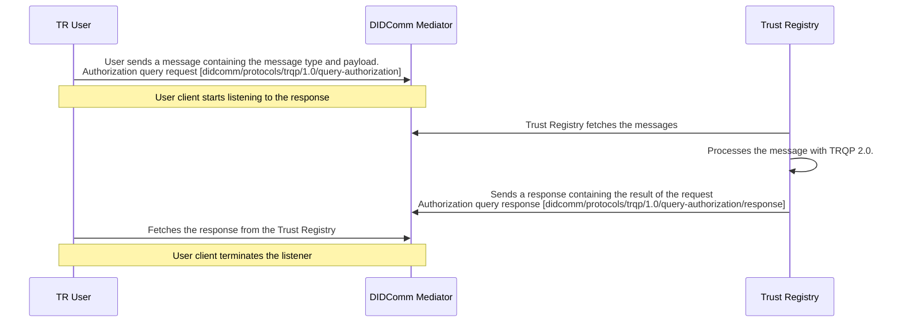

# Trust Registry DIDComm Protocols

Trust Registry utilises DIDComm protocols to manage and query trust records securely and privately.

DIDComm offers a flexible messaging service that enables you to define higher-level protocols, allowing for workflow orchestration tailored to specific purposes.

<!-- omit from toc -->
## Table of Contents

- [Trust Registry Administration](#trust-registry-administration)
  - [Removed: `tr-admin/1.0`](#removed-tr-admin10)
- [Trust Registry Queries](#trust-registry-queries)
  - [Summary](#summary)
  - [Motivation](#motivation)
  - [Roles](#roles)
  - [Requirements](#requirements)
  - [Workflow](#workflow)
  - [Messages](#messages)
- [Problem Reporting](#problem-reporting)
- [Security Considerations](#security-considerations)
- [Implementation](#implementation)


## Trust Registry Administration

Trust records are managed with the `registry/record/*` Trust Tasks
(`registry/record/put/0.1`, `registry/record/delete/0.1` and
`registry/record/query/0.1`), carried in the DIDComm Trust Task envelope
(`https://trusttasks.org/binding/didcomm/0.1/envelope`) or over TSP. See
[Trust Task protocol surface](README.md#trust-task-protocol-surface).

A write is accepted only when all of the following hold:

- the document carries an in-band `issuer`, and that issuer is the sender the
  transport authenticated;
- the document names this registry as its `recipient`, carries an `issuedAt`
  no older than five minutes (and not more than a minute in the future), and
  its `id` has not been accepted before, on any binding;
- the document carries a Data Integrity proof with `proofPurpose`
  `authentication`, made with the issuer's operational key: a verification
  method of the issuer's own DID that the issuer's DID document lists under
  `authentication`. The proof must verify;
- the issuer is listed in `ADMIN_DIDS`;
- the write acts under an authority the issuer may act for: its own DID, or
  one listed for it in `ADMIN_AUTHORITIES`.

For a record put or delete the authority is the record's `authority_id`. For
`git-trust/grant` and `git-trust/revoke` it is the authority git-trust was
enabled with, and for `governance/capability/enable` and `disable` it is the
authority the capability's config names. Every write, accepted or refused, is
written to the audit log.

### Removed: `tr-admin/1.0`

The legacy `https://affinidi.com/didcomm/protocols/tr-admin/1.0` protocol
(`create-record`, `update-record`, `delete-record`, `read-record`,
`list-records`) is no longer served. Messages of those types are not
answered and change nothing. To migrate:

| `tr-admin/1.0` message | Trust Task |
| ---------------------- | ---------- |
| `create-record` | `registry/record/put/0.1` with `"expectedExisting": false` |
| `update-record` | `registry/record/put/0.1` with `"expectedExisting": true` |
| `delete-record` | `registry/record/delete/0.1` |
| `read-record` | `registry/record/query/0.1` naming all four key parts |
| `list-records` | `registry/record/query/0.1` with a filter (paginated) |

Each write must be signed and must name an authority the issuer may write
under, as above. The `test-client` crate shows the full flow.

## Trust Registry Queries

### Summary

A protocol to query trust records from the Trust Registry using TRQP 2.0.

### Motivation

To provide a secure, end-to-end encrypted query messages between Verifiers and Trust Registry.

### Roles

There are two roles defined in querying trust records:

- **Verifier:** The DID that queries the Trust Registry to verify whether a particular DID is authorised or recognised by an authority based on governance framework.
- **Trust Registry:** The DID that processes the request to query trust records and return the result to the requester.

### Requirements

- DIDComm v2.1 protocol.

### Workflow

When querying trust records, the user initiates the request by sending a query message to the Trust Registry's DID through the DIDComm mediator.

*Sample query flow.*


```mermaid
sequenceDiagram
    participant User as TR User
    participant DM as DIDComm Mediator
    participant TR as Trust Registry

    User->>DM: User sends a message containing the message type and payload. <br />Authorization query request [didcomm/protocols/trqp/1.0/query-authorization]
    Note over User, DM: User client starts listening to the response
    TR->>DM: Trust Registry fetches the messages
    TR->>TR: Processes the message with TRQP 2.0.
    TR->>DM: Sends a response containing the result of the request <br />  Authorization query response [didcomm/protocols/trqp/1.0/query-authorization/response]
    User->>DM: Fetches the response from the Trust Registry
    Note over User, DM: User client terminates the listener

```

### Messages

#### query-authorization

A query message to the Trust Registry if a given entity is authorized by a particular authority through its governance framework.

**Message Type URI:**

Action | Message Type |
-------|--------------|
Request | `https://affinidi.com/didcomm/protocols/trqp/1.0/query-authorization` |
Response | `https://affinidi.com/didcomm/protocols/trqp/1.0/query-authorization/response` |

**Message Fields:**

- **`authority_id` REQUIRED** - The DID of the authority who authorised the entity and publishes the governance framework.
- **`entity_id` REQUIRED** - The DID of the entity who is the subject of verification whether it is authorised by the authority.
- **`action` REQUIRED** - A published vocabulary of common actions that the entity is authorised to perform.
- **`resource` REQUIRED** - The resource identifier where the entity can perform the stated action.

**Additional Fields:**

- **`record_type`** - Part of the query response. The type of record requested by the verifier.
- **`time_requested`** - Part of the query response. The date and time the query is sent to the Trust Registry by the verifier.
- **`time_evaluated`** - Part of the query response. The date and time the query is evaluated.
- **`message`** - Part of the query response. A human-readable message about the result of the query.

**Example:**

Request:

```json
{
    "id": "040d3b97-0be8-43f8-8a95-b3a926aadff1",
    "typ": "application/didcomm-plain+json",
    "type_": "https://affinidi.com/didcomm/protocols/trqp/1.0/query-authorization",
    "body": {
      "action": "action_xyz",
      "authority_id": "did:example:authority456",
      "entity_id": "did:example:entity123",
      "resource": "resource_abc"
    },
    "from": "<VERIFIER_DID>",
    "to": [
        "<TRUST_REGISTRY_DID>",
    ],
    "thid": "6a627735-6743-4141-8cb7-1359d778936b"
}
```

Response:

```json
{
    "id": "040d3b97-0be8-43f8-8a95-b3a926aadff2",
    "typ": "application/didcomm-plain+json",
    "type_": "https://affinidi.com/didcomm/protocols/trqp/1.0/query-authorization/response",
    "body": {
      "action": "action_xyz",
      "authority_id": "did:example:authority456",
      "authorized": true,
      "context": {
        "id": "https://governance.example.org/healthcare-framework",
        "type": "GovernanceFramework",
        "name": "Healthcare Trust Framework",
        "version": "2.0"
      },
      "entity_id": "did:example:entity123",
      "resource": "resource_abc",
      "record_type":"Authorization",
      "time_requested":"2025-12-09T05:33:52Z",
      "time_evaluated":"2025-12-09T05:33:52Z",
      "message": "did:example:entity123 authorized to action1+resource1 by did:example:authority456 to issue a certificate credential."
    },
    "from": "<TRUST_REGISTRY_DID>",
    "to": [
        "<VERIFIER_DID>",
    ],
    "thid": "6a627735-6743-4141-8cb7-1359d778936b"
}
```

#### query-recognition

A query message to the Trust Registry if a given entity is recognised by a particular authority through its governance framework.

**Message Type URI:**

Action | Message Type |
-------|--------------|
Request | `https://affinidi.com/didcomm/protocols/trqp/1.0/query-recognition` |
Response | `https://affinidi.com/didcomm/protocols/trqp/1.0/query-recognition/response` |

**Message Fields:**

- **`authority_id` REQUIRED** - The DID of the authority who recognised the entity and publishes the governance framework.
- **`entity_id` REQUIRED** - The DID of the entity who is the subject of verification whether it is recognised by the authority.
- **`action` REQUIRED** - A published vocabulary of common actions that the entity is recognised to perform.
- **`resource` REQUIRED** - The resource identifier where the entity can perform the stated action.

**Additional Fields:**

- **`record_type`** - Part of the query response. The type of record requested by the verifier.
- **`time_requested`** - Part of the query response. The date and time the query is sent to the Trust Registry by the verifier.
- **`time_evaluated`** - Part of the query response. The date and time the query is evaluated.
- **`message`** - Part of the query response. A human-readable message about the result of the query.

**Example:**

Request:

```json
{
    "id": "040d3b97-0be8-43f8-8a95-b3a926aadff1",
    "typ": "application/didcomm-plain+json",
    "type_": "https://affinidi.com/didcomm/protocols/trqp/1.0/query-recognition",
    "body": {
      "action": "action_xyz",
      "authority_id": "did:example:authority456",
      "entity_id": "did:example:entity123",
      "resource": "resource_abc"
    },
    "from": "<VERIFIER_DID>",
    "to": [
        "<TRUST_REGISTRY_DID>",
    ],
    "thid": "6a627735-6743-4141-8cb7-1359d778936b"
}
```

Response:

```json
{
    "id": "040d3b97-0be8-43f8-8a95-b3a926aadff2",
    "typ": "application/didcomm-plain+json",
    "type_": "https://affinidi.com/didcomm/protocols/trqp/1.0/query-recognition/response",
    "body": {
      "action": "action_xyz",
      "authority_id": "did:example:authority456",
      "recognized": true,
      "context": {
        "id": "https://governance.example.org/healthcare-framework",
        "type": "GovernanceFramework",
        "name": "Healthcare Trust Framework",
        "version": "2.0"
      },
      "entity_id": "did:example:entity123",
      "resource": "resource_abc",
      "record_type":"Recognition",
      "time_requested":"2025-12-09T05:33:52Z",
      "time_evaluated":"2025-12-09T05:33:52Z",
      "message": "did:example:entity123 is recognized by did:example:authority456 to issue a certificate credential."
    },
    "from": "<TRUST_REGISTRY_DID>",
    "to": [
        "<VERIFIER_DID>",
    ],
    "thid": "6a627735-6743-4141-8cb7-1359d778936b"
}
```

## Problem Reporting

The existing Problem Reports defined within the DIDComm v2.1 protocol specification for standard reporting of any issues encountered during the data sharing flow.

The [PIURI](https://identity.foundation/didcomm-messaging/spec/v2.1/#protocol-identifier-uri) for this protocol is `https://didcomm.org/report-problem/2.0`.

```json
{
  "type_": "https://didcomm.org/report-problem/2.0/problem-report",
  "id": "345e6789-e89b-12d3-a456-426614174222",
  "pthid": "6a627735-6743-4141-8cb7-1359d778936b",
  "body": {
    "code": "e.p.msg.internal-error",
    "comment": "Record not found: Record not found: did:example:entity123|did:example:authority456|action_xyz|resource_abc"
  }
}
```

Aside from Trust Registry specific errors, the system also returns errors from the mediator, such as Access Control Lists (ACLs) and message routing issues.

For more information, visit the [Problem Reports](https://identity.foundation/didcomm-messaging/spec/v2.1/#problem-reports) section.


## Security Considerations

The protocol requires that all message exchanges between the Administrator and the Trust Registry **MUST** be encrypted and verifiable to ensure confidentiality, integrity, and authenticity.

- All messages **MUST** use `authcrypt` encryption envelope (e.g., `authcrypt(plaintext)`) to verify the sender authority and the content remains confidential throughout transmission.

**Trust Registry Administration**

- The Trust Registry **MUST** assign an appropriate ACL to the Administrator's DID.

- The Trust Registry **MUST NOT** treat the authenticated DIDComm sender as sufficient to change a record. A change is authorised by the Data Integrity proof on the Trust Task, bound to the in-band `issuer`, which must also be the authenticated sender.

- An administrator **MUST** only be able to write records under an authority it is allowed to act for: its own DID, or one the operator lists for it in `ADMIN_AUTHORITIES`.

## Implementation

See the [Trust Registry for Rust](https://github.com/affinidi/affinidi-trust-registry-rs/tree/main/trust-registry/src/didcomm) implementation.