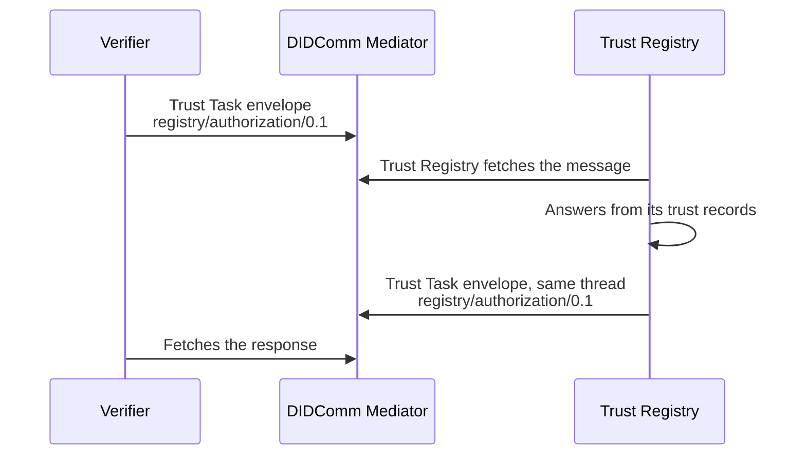

# Trust Registry DIDComm Protocols

Trust Registry uses DIDComm as one of the transports for its Trust Tasks, to manage and query trust records securely and privately.

Every remote operation is a `registry/*` [Trust Task](https://trusttasks.org), carried over DIDComm in the Trust Task envelope (`https://trusttasks.org/binding/didcomm/0.1/envelope`). The same documents are answered identically over TSP and, for the queries, over HTTPS (`POST /trust-tasks`). The registry serves no other DIDComm protocol.

<!-- omit from toc -->
## Table of Contents

- [Trust Registry Administration](#trust-registry-administration)
- [Trust Task Queries](#trust-task-queries)
  - [Roles](#roles)
  - [Workflow](#workflow)
  - [`registry/authorization/0.1`](#registryauthorization01)
  - [`registry/recognition/0.1`](#registryrecognition01)
- [Removed Protocols](#removed-protocols)
  - [`tr-admin/1.0`](#tr-admin10)
  - [`trqp/1.0`](#trqp10)
- [Problem Reporting](#problem-reporting)
- [Security Considerations](#security-considerations)
- [Implementation](#implementation)


## Trust Registry Administration

Trust records are managed with the `registry/record/*` Trust Tasks
(`registry/record/put/0.1`, `registry/record/delete/0.1` and
`registry/record/query/0.1`), carried in the DIDComm Trust Task envelope
(`https://trusttasks.org/binding/didcomm/0.1/envelope`) or over TSP. See
[Trust Task protocol surface](README.md#trust-task-protocol-surface).

A write — and a `registry/record/query`, which returns whole records including
their `context` — is accepted only when all of the following hold:

- the document carries an in-band `issuer`, and that issuer is the sender the
  transport authenticated;
- the document names this registry as its `recipient`, carries an `issuedAt`
  no older than five minutes (and not more than a minute in the future), and
  its `id` has not been accepted before, on any binding;
- the document carries a Data Integrity proof with `proofPurpose`
  `authentication`, made with the issuer's operational key: a verification
  method of the issuer's own DID that the issuer's DID document lists under
  `authentication`. The proof must verify;
- the issuer is listed in `ADMIN_DIDS`;
- the write acts under an authority the issuer may act for: its own DID, or
  one listed for it in `ADMIN_AUTHORITIES`.

For a record put, delete or query the authority is the `authority_id` it names
(a query must name one). For
`git-trust/grant` and `git-trust/revoke` it is the authority git-trust was
enabled with, and for `governance/capability/enable` and `disable` it is the
authority the capability's config names. Every write, accepted or refused, is
written to the audit log.

## Trust Task Queries

Recognition and authorization queries are the `registry/recognition/0.1` and
`registry/authorization/0.1` Trust Tasks. They need no proof and no admin
listing: anyone may ask. The payload fields are the
[TRQP v2.0](https://trustoverip.github.io/tswg-trust-registry-protocol/)
names, verbatim.

### Roles

- **Verifier:** the DID that asks whether an entity is authorised or recognised by an authority under its governance framework.
- **Trust Registry:** the DID that answers from its trust records.

### Workflow

The verifier sends the Trust Task to the Trust Registry's DID through the DIDComm mediator, authcrypted, as the body of a Trust Task envelope. The registry answers on the same thread with the `#response` document, or a `trust-task-error` document.


```mermaid
sequenceDiagram
    participant User as Verifier
    participant DM as DIDComm Mediator
    participant TR as Trust Registry

    User->>DM: Trust Task envelope <br />registry/authorization/0.1
    TR->>DM: Trust Registry fetches the message
    TR->>TR: Answers from its trust records
    TR->>DM: Trust Task envelope, same thread <br />registry/authorization/0.1#response
    User->>DM: Fetches the response
```

### `registry/authorization/0.1`

Is the entity authorised by the authority to take the action on the resource?

**Request payload:**

- **`entity_id` REQUIRED** - the DID of the entity being checked.
- **`authority_id` REQUIRED** - the DID of the authority whose governance framework applies.
- **`action` REQUIRED** - the action the entity would take.
- **`resource` REQUIRED** - the resource it would take it on.
- **`context`** - optional; `context.time` is echoed back as `time_requested`.

**Response payload:** the four identifiers, echoed; `authorized` (`false` when no record matches: absence is a denial, not an error); `time_evaluated`; `time_requested` when the request carried one; and an advisory `message`.

DIDComm message (body abbreviated to the Trust Task document):

```json
{
    "id": "040d3b97-0be8-43f8-8a95-b3a926aadff1",
    "type": "https://trusttasks.org/binding/didcomm/0.1/envelope",
    "from": "<VERIFIER_DID>",
    "to": ["<TRUST_REGISTRY_DID>"],
    "thid": "urn:uuid:6a627735-6743-4141-8cb7-1359d778936b",
    "body": {
        "id": "urn:uuid:6a627735-6743-4141-8cb7-1359d778936b",
        "type": "https://trusttasks.org/spec/registry/authorization/0.1",
        "issuer": "<VERIFIER_DID>",
        "recipient": "<TRUST_REGISTRY_DID>",
        "issuedAt": "2026-09-27T05:33:52Z",
        "payload": {
            "entity_id": "did:example:entity123",
            "authority_id": "did:example:authority456",
            "action": "action_xyz",
            "resource": "resource_abc"
        }
    }
}
```

Response body:

```json
{
    "id": "urn:uuid:9d2c1e3f-4a5b-4c6d-8e7f-0a1b2c3d4e5f",
    "type": "https://trusttasks.org/spec/registry/authorization/0.1#response",
    "threadId": "urn:uuid:6a627735-6743-4141-8cb7-1359d778936b",
    "issuer": "<TRUST_REGISTRY_DID>",
    "recipient": "<VERIFIER_DID>",
    "payload": {
        "entity_id": "did:example:entity123",
        "authority_id": "did:example:authority456",
        "action": "action_xyz",
        "resource": "resource_abc",
        "authorized": true,
        "time_evaluated": "2026-09-27T05:33:52Z",
        "message": "did:example:entity123 authorized to action_xyz+resource_abc by did:example:authority456"
    }
}
```

### `registry/recognition/0.1`

Is the entity recognised by the authority for the action on the resource? The
request payload is the same four identifiers (and optional `context`); the
response carries `recognized` in place of `authorized`, with the same
absence-is-denial rule.

## Removed Protocols

### `tr-admin/1.0`

The legacy `https://affinidi.com/didcomm/protocols/tr-admin/1.0` protocol
(`create-record`, `update-record`, `delete-record`, `read-record`,
`list-records`) is no longer served. Messages of those types are not
answered and change nothing. To migrate:

| `tr-admin/1.0` message | Trust Task |
| ---------------------- | ---------- |
| `create-record` | `registry/record/put/0.1` with `"expectedExisting": false` |
| `update-record` | `registry/record/put/0.1` with `"expectedExisting": true` |
| `delete-record` | `registry/record/delete/0.1` |
| `read-record` | `registry/record/query/0.1` naming all four key parts, signed |
| `list-records` | `registry/record/query/0.1` naming an `authority_id` (plus any other filter; paginated), signed |

Each of these must be signed and must name an authority the issuer may act
under, as above: `registry/record/query` is for admins, not the public. The
public surface is the [Trust Task queries](#trust-task-queries). The
`test-client` crate shows the full flow.

### `trqp/1.0`

The bespoke `https://affinidi.com/didcomm/protocols/trqp/1.0` query protocol
(`query-authorization`, `query-recognition`) is no longer served, and neither
are the raw TRQP REST routes `POST /recognition` and `POST /authorization`.
Messages of those types are not answered. To migrate:

| Removed | Trust Task |
| ------- | ---------- |
| `trqp/1.0/query-authorization`, `POST /authorization` | `registry/authorization/0.1` |
| `trqp/1.0/query-recognition`, `POST /recognition` | `registry/recognition/0.1` |

The payload keeps the same four TRQP identifiers. The response no longer merges
a request `context` into the record's, nor carries `record_type` or the
record's `context`; a tuple with no record answers `false` rather than an
error (the REST routes returned 404). Over HTTPS, `POST` the Trust Task
document to `/trust-tasks`.

## Problem Reporting

Trust Task failures are answered with a `trust-task-error` document on the request's thread. The registry also recognises the Problem Reports defined within the DIDComm v2.1 protocol specification, which the mediator uses for transport-level failures.

The [PIURI](https://identity.foundation/didcomm-messaging/spec/v2.1/#protocol-identifier-uri) for this protocol is `https://didcomm.org/report-problem/2.0`.

```json
{
  "type_": "https://didcomm.org/report-problem/2.0/problem-report",
  "id": "345e6789-e89b-12d3-a456-426614174222",
  "pthid": "6a627735-6743-4141-8cb7-1359d778936b",
  "body": {
    "code": "e.p.msg.internal-error",
    "comment": "Record not found: Record not found: did:example:entity123|did:example:authority456|action_xyz|resource_abc"
  }
}
```

Aside from Trust Registry specific errors, the system also returns errors from the mediator, such as Access Control Lists (ACLs) and message routing issues.

For more information, visit the [Problem Reports](https://identity.foundation/didcomm-messaging/spec/v2.1/#problem-reports) section.


## Security Considerations

The protocol requires that all message exchanges between the Administrator and the Trust Registry **MUST** be encrypted and verifiable to ensure confidentiality, integrity, and authenticity.

- All messages **MUST** use `authcrypt` encryption envelope (e.g., `authcrypt(plaintext)`) to verify the sender authority and the content remains confidential throughout transmission.

**Trust Registry Administration**

- The Trust Registry **MUST** assign an appropriate ACL to the Administrator's DID.

- The Trust Registry **MUST NOT** treat the authenticated DIDComm sender as sufficient to change a record. A change is authorised by the Data Integrity proof on the Trust Task, bound to the in-band `issuer`, which must also be the authenticated sender.

- An administrator **MUST** only be able to write records under an authority it is allowed to act for: its own DID, or one the operator lists for it in `ADMIN_AUTHORITIES`.

## Implementation

See the [Trust Registry for Rust](https://github.com/affinidi/affinidi-trust-registry-rs/tree/main/trust-registry/src/didcomm) implementation.